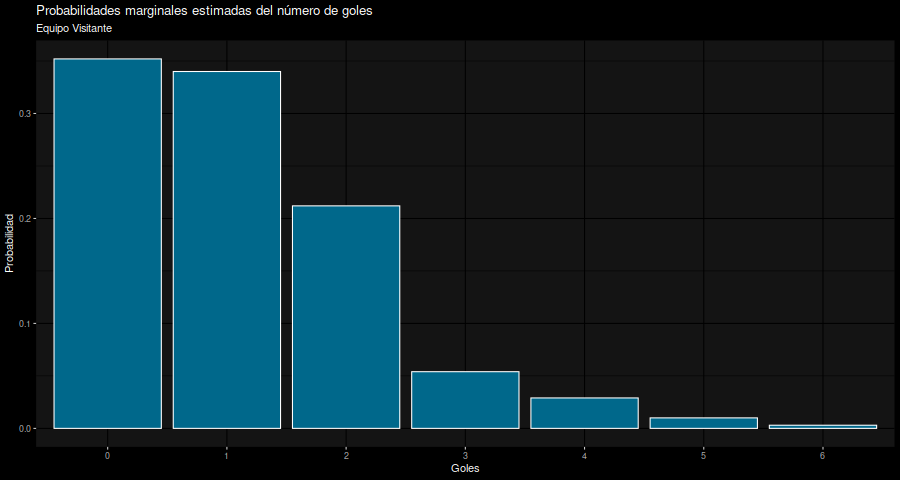
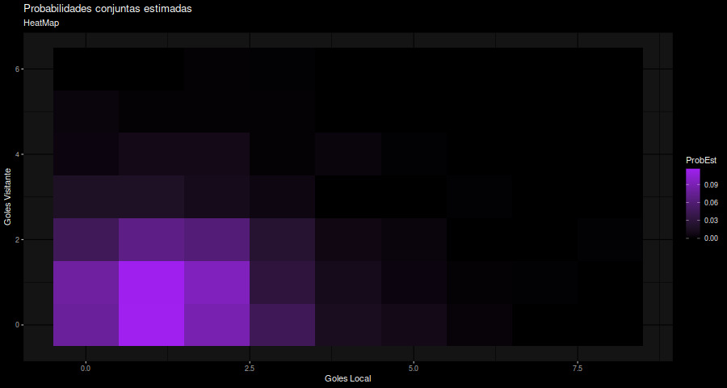

#  Análisis Exploratorio de Datos (AED o EDA)

## Postwork Sesión 3

Ahora graficaremos probabilidades (estimadas) marginales y conjuntas para el número de goles que anotan en un partido el equipo de casa o el equipo visitante.

1. Con el último data frame obtenido en el postwork de la sesión 2, elabora tablas de frecuencias relativas para estimar las siguientes probabilidades:

- La probabilidad (marginal) de que el equipo que juega en casa anote x goles (x=0,1,2,)

- La probabilidad (marginal) de que el equipo que juega como visitante anote y goles (y=0,1,2,)

- La probabilidad (conjunta) de que el equipo que juega en casa anote x goles y el equipo que juega como visitante anote y goles (x=0,1,2,, y=0,1,2,)

2. Realiza lo siguiente:

- Un gráfico de barras para las probabilidades marginales estimadas del número de goles que anota el equipo de casa.
- Un gráfico de barras para las probabilidades marginales estimadas del número de goles que anota el equipo visitante.
- Un HeatMap para las probabilidades conjuntas estimadas de los números de goles que anotan el equipo de casa y el equipo visitante en un partido.

__Notas para los datos de soccer:__ https://www.football-data.co.uk/notes.txt

